# Portfolio

[Link to Portfolio](https://roaring-caramel-c93106.netlify.app)

[Link to Github Repository](https://github.com/beatsnob/portfolio)

## Purpose and target audience

While this website was created as a response to an assignment (T1A2-Portfolio), its purpose goes beyond the assignment requirements. This website is intended to present my budding skills as an up and coming web developer. This website also exists to showcase my abilities to potential employers who possess sound technical knowledge and a high understanding of IT, software development, coding and programming languages and development stacks. This website has been designed with a straightforward and minimalistic design that is intentional and in line with my aesthetic style in order to exhibit a high level of professionalism accompanied with a positive work ethic.

## Functionality/features

The website includes 9 individual html pages that link together in a logical way using the navigation bar and the logo at the top of every page or an in-page link that returns to its parent page. It is also fully responsive on mobile, tablet and desktop viewports with standard accessibility features built in for those who require a screenreader to navigate.

The html pages include:

- Index/landing page has a simple design, displaying my name, contact details and links to my professional social media accounts.
- About page includes a framed pop-up .png file picture of myself above a short blurb of my background.
- Blog page is a contents page of a mock-up blog that links to five individual ‘blog’ pages where an imaginary post consists of a blog title, an image, the author of the post and the date that it was published along with a link at the bottom that returns to the contents page.
- Projects page displays web projects that I have ‘completed’. This page has images of buildings under construction along with numbered project titles to illustrate that I have not yet fully completed any such projects.

## Sitemap

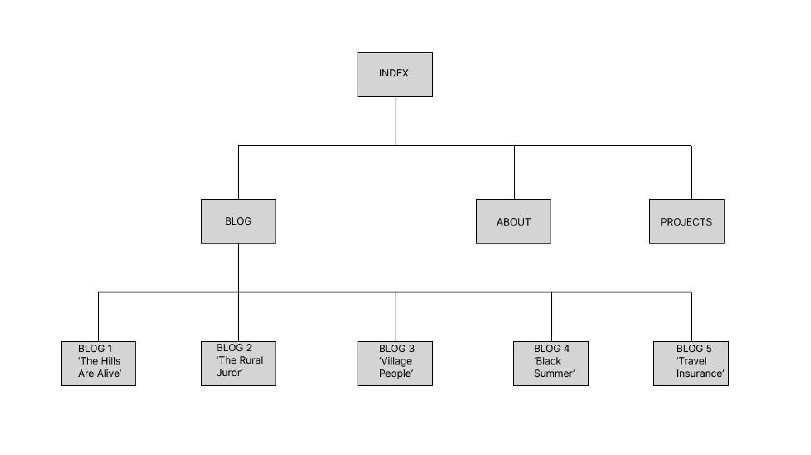

## Screenshots & wireframes

### Index page wireframes
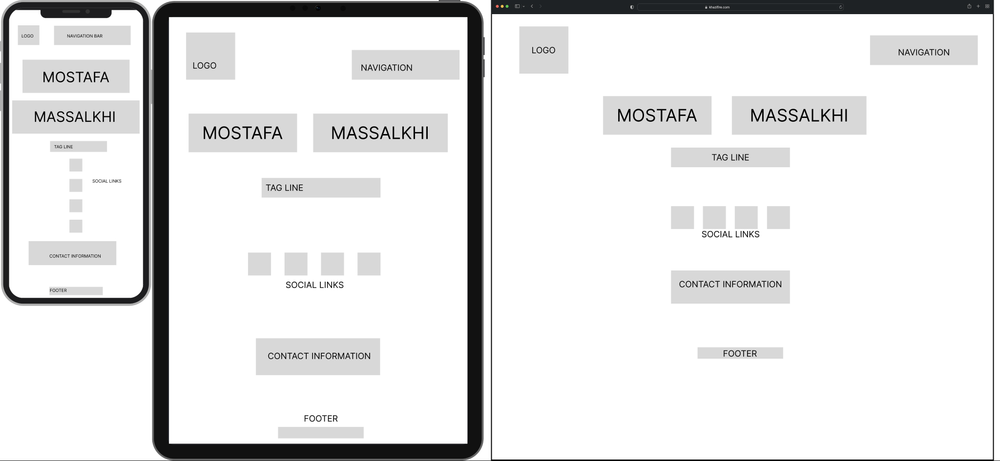

### Index page screenshots
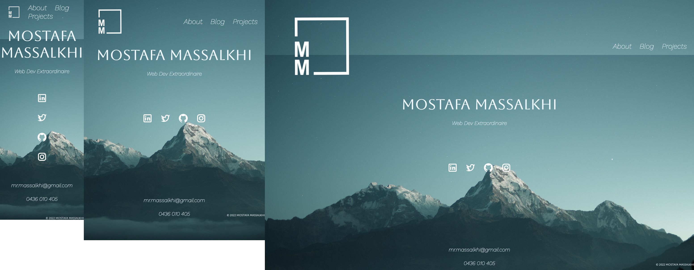

### About page wireframes
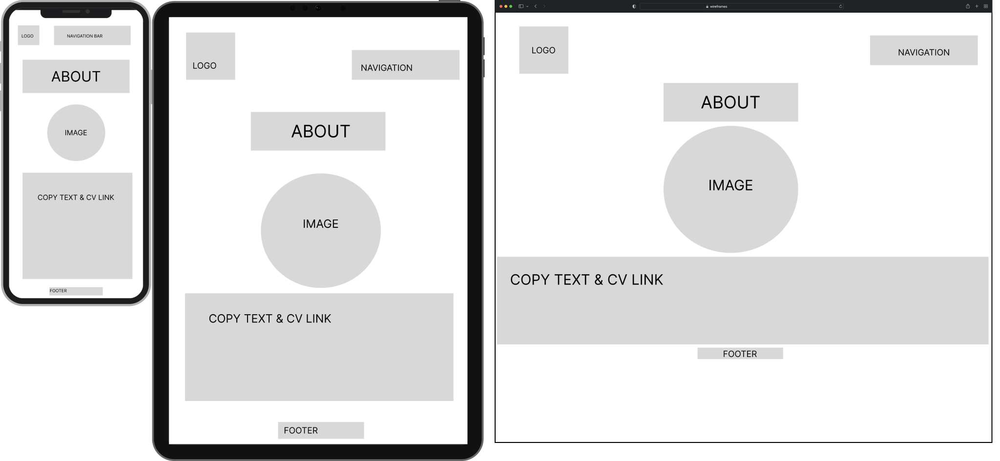

### About page screenshots
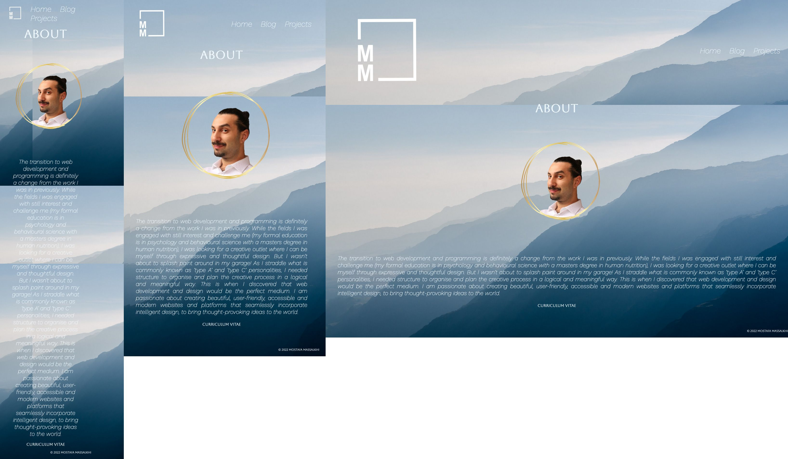

### Blog page wireframes
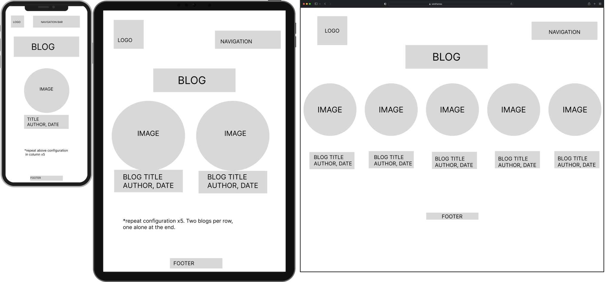

### Blog page screenshots
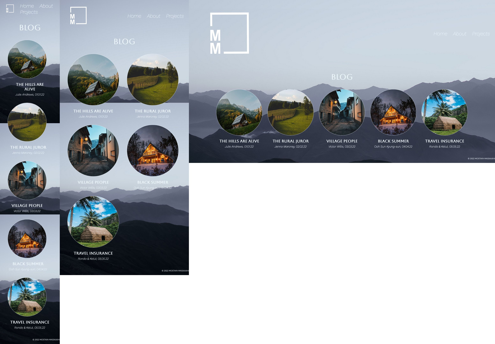

### Blog post wireframes
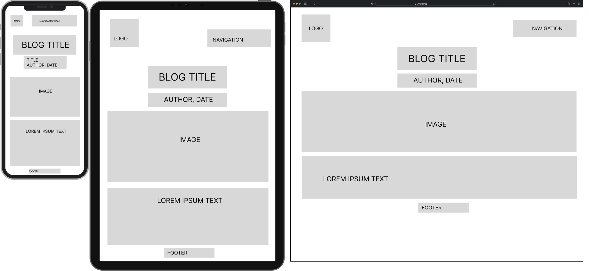

### Blog post screenshots
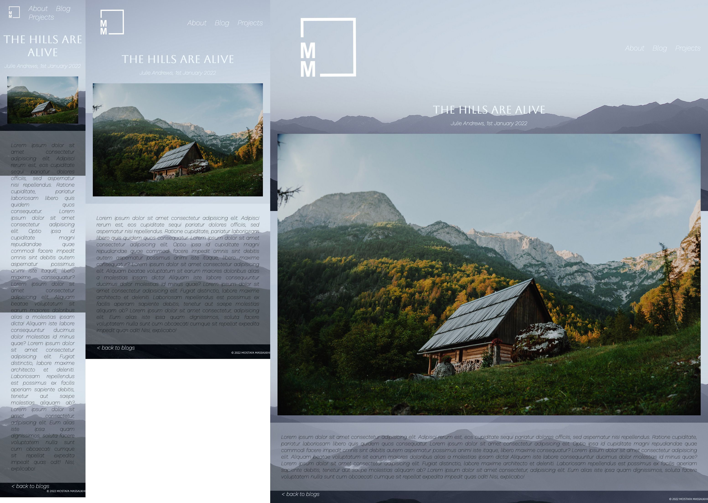

### Projects page wireframes
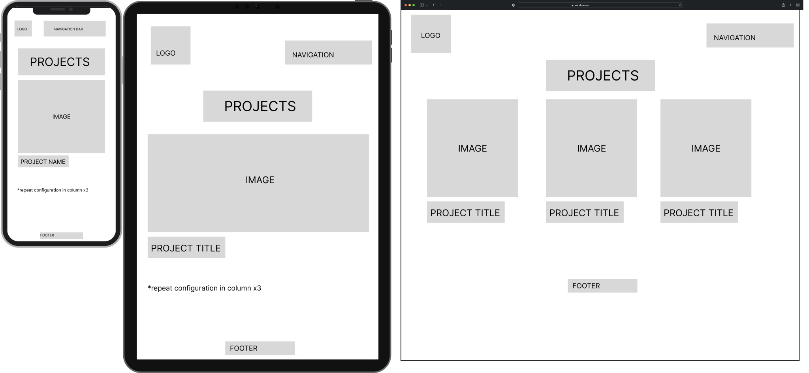

### Projects page screenshots
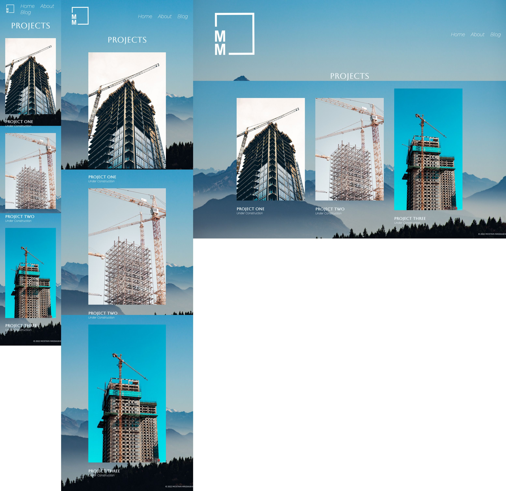

## Tech stack

- Sitemap and wireframes: Desktop application version of Figma.
- Website deployment: Netlify
- Website structure: HTML5.
- Stylesheets: CSS3.
- Screenshots taken using Movavi ScreenShot browser extension for Mozilla Firefox.
- Images edited using Figma and FilesMerge.